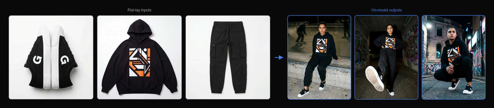

<p align="center">
  
  </br>
  <h3 align="center"><a href="https://on-model.com">Flat-to-Model by PiktID</a></h3>
</p>

<p align="center">
  <b>Transform flat-lay product photos into realistic on-model imagery with AI.</b>
  <br/>

</p>

<p align="center">
  
</p>

# Flat-to-Model - v1.0
[](https://on-model.com)
[](https://app.on-model.com)
[](https://discord.com/invite/FJU39e9Z4P)

Flat-to-Model implementation by PiktID for generating on-model Product Detail Page (PDP) images from flat-lay/SKU product photography. This script takes article images and generates realistic on-model photos using the <a href="https://v2.api.piktid.com">PiktID v2 API</a>.

## Why On-Model?

- **Flat-lay to on-model in minutes** — Upload a flat-lay, mannequin, or hanger shot and get realistic on-model images with full control over pose, background, and style.
- **Garment preservation** — Pixel-perfect accuracy on textures, patterns, stitching, and fit.
- **50+ diverse AI identities** — Models spanning ages, genders, ethnicities, and body types (XS–XL). Or upload your own brand model.
- **Custom presets** — Built-in presets for PDP, editorial, lifestyle, and social media. Or create your own.
- **Batch processing** — Process entire product catalogs with parallel workers. Scale from 10 SKUs to 10,000.
- **Full API access** — Automate image generation in your existing workflow, PIM system, or custom pipeline.
- **4K output** — Production-ready resolution for web, print, and advertising.

Built by PiktID — the team behind [Studio](https://studio.piktid.com) and EraseID, used by 300,000+ people for AI-powered image processing.

## About On-Model

[On-Model](https://on-model.com) is an AI-powered platform by PiktID designed for fashion e-commerce. It enables brands, retailers, and marketplaces to transform their product imagery at scale:

- **Flat-to-Model** — Convert flat-lay product photography into realistic on-model images
- **Model Swap** — Replace models in existing product photos while preserving garments exactly as they are
- **Identity Management** — Create and maintain consistent AI model identities across your entire catalog

Try the platform at [app.on-model.com](https://app.on-model.com) — **15 free images per month**, no credit card required.

## Getting Started

The following instructions suppose you have already installed a recent version of Python. For a general overview, please visit the <a href="https://docs.piktid.com/docs/v2">API documentation</a>.

> **Step 0** - Register at <a href="https://app.on-model.com">app.on-model.com</a>. 15 images are given for free to all new users every month. Then generate an API token from your [profile dashboard](https://app.on-model.com/profile?tab=tokens).

> **Step 1** - Clone the Flat-to-Model repository
```bash
# Installation commands
$ git clone https://github.com/piktid/flat-to-model.git
$ cd flat-to-model
$ pip install requests
```

> **Step 2** - Prepare your SKU folder with images

Place your flat-lay/article images (JPG, JPEG, or PNG format) in a folder. Unlike model-swap where each input image produces one output, flat-to-model combines ALL input images for each output — the AI sees every angle of the garment to generate realistic on-model photos.

> **Step 3** - Choose your identity

You can either use an existing identity code from your gallery or upload a new identity image:

**Option A: Using an existing identity code**
```bash
$ python flat_to_model.py \
  --input-folder SKU/ARTICLE123 \
  --token YOUR_API_TOKEN \
  --identity-code PiktidSummer \
  --output-folder results/ARTICLE123
```

**Option B: Uploading a new identity image**
```bash
$ python flat_to_model.py \
  --input-folder SKU/ARTICLE123 \
  --token YOUR_API_TOKEN \
  --identity-image identities/female/LisaSummer.jpg \
  --output-folder results/ARTICLE123
```

> **Step 4** - Monitor the processing

The script will automatically:
1. Authenticate with the API
2. Upload all SKU images from the input folder
3. Create a project (or reuse an existing one)
4. Upload or verify the identity
5. Build instructions from CLI flags or JSON file
6. Create a flat-to-model job
7. Monitor job progress
8. Download results to the output folder

You'll see progress updates in the console. Once complete, generated images will be saved to your output folder.

> **Step 5** - Review results

Results are saved to the output folder with the following structure:
```
output/
├── output_0_0_v0.jpg     # First instruction, first variation
├── output_0_1_v0.jpg     # First instruction, second variation
├── output_1_0_v0.jpg     # Second instruction, first variation
└── metadata.json         # Complete job information and results
```

The `metadata.json` file contains:
- Job ID and status
- Processing results for each output
- Quality scores and processing times
- Image URLs and metadata

## API Flow

The script follows this sequence of API calls:

All requests are authenticated with a Bearer token (generated from your [profile dashboard](https://app.on-model.com/profile?tab=tokens)) in the `Authorization` header.

```
1. POST /upload             -> Get pre-signed S3 URL + file_id (per image)
2. PUT  <upload_url>        -> Upload image binary to S3
3. POST /project            -> Create project (get project_id)
4. GET  /identity/<code>    -> Verify identity exists
   or POST /identity/upload -> Upload new identity image
5. POST /flat-2-model       -> Submit job with project_id + file_ids + instructions
6. GET  /jobs/<id>/status   -> Poll until status = "completed"
7. GET  /jobs/<id>/results  -> Fetch output images (CloudFront URLs)
```

**Key difference from model-swap:** Step 6 sends ALL uploaded image UUIDs together (not one at a time) along with an `instructions` array that controls how many outputs are generated and with what parameters.

## Instructions

Instructions control what gets generated. Each instruction produces one output image (or multiple variations). You can provide instructions in two ways:

### Simple Mode (CLI Flags)

Use individual flags to build a single instruction:

```bash
$ python flat_to_model.py \
  --input-folder SKU/ARTICLE123 \
  --token YOUR_API_TOKEN \
  --identity-code PiktidSummer \
  --pose "standing front-facing" \
  --background "white studio" \
  --aspect-ratio 3:4 \
  --size 2K \
  --num-variations 2
```

### Advanced Mode (JSON File)

For multiple instructions or complex configurations, use `--instructions-file`:

```bash
$ python flat_to_model.py \
  --input-folder SKU/ARTICLE123 \
  --token YOUR_API_TOKEN \
  --identity-code PiktidSummer \
  --instructions-file instructions.json
```

See `example_instructions.json` for the full format. The JSON file should contain a list of instruction objects:

```json
[
  {
    "pose": "standing front-facing",
    "background": "white studio",
    "options": { "ar": "3:4", "size": "2K" }
  },
  {
    "pose": "walking side angle",
    "background": "urban street",
    "options": { "ar": "3:4", "size": "2K" }
  }
]
```

### Instruction Fields

| Field | Type | Description |
|-------|------|-------------|
| `prompt` | string | Free-form text prompt describing the desired output |
| `pose` | string | Pose for the model (e.g., "standing", "walking", "sitting") |
| `background` | string | Background description (e.g., "white studio", "urban street") |
| `seed` | int | Seed value for reproducibility |
| `num_variations` | int (1-4) | Number of variations to generate for this instruction |
| `options.size` | string | Output resolution: "1K", "2K", or "4K" |
| `options.ar` | string | Aspect ratio: "1:1", "3:4", "4:3", "9:16", "16:9" |
| `options.format` | string | Output format: "png" or "jpg" |

## Command Line Options

```
--input-folder        Path to folder containing SKU/article images (required)
--token               API token (required) — generate at https://app.on-model.com/profile?tab=tokens
--identity-code       Existing identity code to use (optional)
--identity-image      Path to identity image file to upload (optional)
--output-folder       Output folder for results (default: output)
--base-url            API base URL (default: https://v2.api.piktid.com)
```

**Instruction flags (simple mode):**
```
--prompt              Text prompt describing the desired output
--pose                Pose for the generated model
--background          Background description
--num-variations      Number of output variations (1-4, default: 1)
--size                Output resolution: 1K, 2K, 4K
--aspect-ratio        Aspect ratio: 1:1, 3:4, 4:3, 9:16, 16:9
--format              Output format: png, jpg
--seed                Seed value for reproducibility
```

**Advanced mode:**
```
--instructions-file   Path to JSON file with instructions (overrides simple flags)
```

**Generation options (job-level, apply to the whole job — not per instruction):**
```
--model               Generation engine: auto | nano_banana_pro | seedream (default: auto)
--no-consistency      Disable the consistency enhancement (enabled by default)
```

**Note:** Either `--identity-code` or `--identity-image` must be provided.

## Advanced: choosing a generation model

By default, On-Model picks the best generation engine for you (`--model auto`). The default engine runs with a safety fallback if the primary engine refuses the content. You can also force a specific engine:

```bash
$ python flat_to_model.py \
  --input-folder SKU/P1KT1D-Y22 \
  --token YOUR_API_TOKEN \
  --identity-code PiktidSummer \
  --model seedream
```

Accepted values: `auto` (default), `nano_banana_pro`, `seedream`. Forcing a specific engine disables the safety fallback — if that engine refuses the content, the job fails instead of switching engines.

Each entry in the job results response carries a `model_used` field indicating which engine actually produced that image. The script prints it next to each downloaded file (e.g. `Downloaded: output_0_0_v0.jpg (model: nano_banana_pro)`) and the raw value is preserved in `metadata.json`.

## Advanced: cross-output consistency

When a single job produces multiple outputs, On-Model enhances visual consistency across them so the set feels cohesive — steadier styling details, more unified overall look. This is enabled by default. If you prefer each output to be generated fully independently (for example, to explore a wider range of looks), add `--no-consistency`:

```bash
$ python flat_to_model.py \
  --input-folder SKU/P1KT1D-Y22 \
  --token YOUR_API_TOKEN \
  --identity-code PiktidSummer \
  --instructions-file example_instructions.json \
  --no-consistency
```

This setting is a job-level option, not per-instruction. There is no field for it inside `example_instructions.json` — it's controlled entirely by the CLI flag (or, if you build the request body yourself, by `options.use_anchor` on the top-level payload).

## Usage Examples

### Example 1: Basic Generation

Generate an on-model image with default settings:
```bash
$ python flat_to_model.py \
  --input-folder SKU/P1KT1D-Y22 \
  --token YOUR_API_TOKEN \
  --identity-code PiktidSummer \
  --output-folder output/P1KT1D-Y22
```

### Example 2: Custom Pose and Background

Specify pose, background, and output format:
```bash
$ python flat_to_model.py \
  --input-folder SKU/P1KT1D-Y22 \
  --token YOUR_API_TOKEN \
  --identity-code PiktidSummer \
  --pose "standing front-facing" \
  --background "white studio" \
  --aspect-ratio 3:4 \
  --size 2K \
  --output-folder output/P1KT1D-Y22
```

### Example 3: Multiple Variations

Generate 3 variations of the same instruction:
```bash
$ python flat_to_model.py \
  --input-folder SKU/P1KT1D-Y22 \
  --token YOUR_API_TOKEN \
  --identity-code PiktidSummer \
  --pose "standing" \
  --num-variations 3 \
  --output-folder output/P1KT1D-Y22
```

### Example 4: Multiple Instructions via JSON

Generate multiple outputs with different poses:
```bash
$ python flat_to_model.py \
  --input-folder SKU/P1KT1D-Y22 \
  --token YOUR_API_TOKEN \
  --identity-code PiktidSummer \
  --instructions-file example_instructions.json \
  --output-folder output/P1KT1D-Y22
```

## Batch Processing (Parallel)

For processing multiple SKU folders at once, use `batch_flat2model.py`. It runs multiple `FlatToModel` instances in parallel using a thread pool, with each worker handling a complete independent workflow.

### Process all subfolders in a directory

```bash
$ python batch_flat2model.py \
  --input-dir SKU/ \
  --token YOUR_API_TOKEN \
  --identity-code PiktidSummer \
  --output-dir results/
```

This scans `SKU/` for subfolders and processes each one as a separate job. Results are saved to `results/<folder-name>/`.

### Process specific folders

```bash
$ python batch_flat2model.py \
  --input-folders SKU/ARTICLE1 SKU/ARTICLE2 SKU/ARTICLE3 \
  --token YOUR_API_TOKEN \
  --identity-image identities/female/LisaSummer.jpg \
  --output-dir results/ \
  --parallel 5
```

### Batch with instructions file

```bash
$ python batch_flat2model.py \
  --input-dir SKU/ \
  --token YOUR_API_TOKEN \
  --identity-code PiktidSummer \
  --instructions-file instructions.json \
  --output-dir results/
```

The same instructions file is applied to every SKU folder in the batch.

### Batch Command Line Options

```
--input-dir           Directory containing SKU subfolders (mutually exclusive with --input-folders)
--input-folders       Specific SKU folder paths to process (mutually exclusive with --input-dir)
--token               API token (required) — generate at https://app.on-model.com/profile?tab=tokens
--identity-code       Existing identity code to use (optional)
--identity-image      Path to identity image file to upload (optional)
--output-dir          Base output directory (default: output)
--base-url            API base URL (default: https://v2.api.piktid.com)
--parallel            Number of parallel workers (default: 3, max: 5)
```

All instruction flags (`--prompt`, `--pose`, `--background`, `--instructions-file`, etc.) are also supported and passed through to each worker.

Parallelism is capped at 5 to respect the API rate limit (5 requests/minute on `/flat-2-model`). The built-in retry mechanism handles any 429 responses that occur when jobs are submitted close together.

A JSON summary file is saved to the output directory after each batch run with timing and success/failure details for every folder.

## Rate Limiting and Resilience

The script includes built-in handling for API rate limits:

- **Rate limiting (429):** All API calls automatically retry with exponential backoff (1s, 2s, 4s, 8s, 16s) plus random jitter, up to 5 retries per request
- **Token expiry (401):** If your token has expired, the script will print an error. Generate a new token at [app.on-model.com/profile?tab=tokens](https://app.on-model.com/profile?tab=tokens).

The `/flat-2-model` endpoint is rate-limited to **5 requests per minute**. The retry mechanism handles this transparently.

## Troubleshooting

### Authentication Failed
```
Token expired or invalid
```
**Solution:** Generate a new API token at [app.on-model.com/profile?tab=tokens](https://app.on-model.com/profile?tab=tokens). Tokens can be set to expire up to 4 years from issuance.

### No Images Found
```
No images found in SKU/ARTICLE123
```
**Solution:**
- Verify the input folder path is correct
- Check that the folder contains image files (JPG, JPEG, PNG)

### Identity Not Found
```
Error checking identity: ...
```
**Solution:**
- Verify the identity code exists in your gallery at [app.on-model.com](https://app.on-model.com)
- Or provide an `--identity-image` path to upload a new identity

### Invalid Instructions File
```
Invalid instructions file: expected a list or {"instructions": [...]}
```
**Solution:**
- Ensure your JSON file contains a list of instruction objects, or a dict with an `"instructions"` key
- Validate the JSON syntax (use `python -m json.tool instructions.json` to check)

### Rate Limited
```
Rate limited (429). Waiting 2.1s before retry 1/5...
```
This is normal behavior. The script automatically retries with increasing delays. If you see "Max retries exceeded", wait a minute and try again.

### Job Timeout
```
Timeout: Job took longer than 1200 seconds
```
**Solution:** The job may be taking longer than expected. Check the API server status. You can modify the `max_wait_time` parameter in the `wait_for_job` method if needed.

### Connection Errors
```
Authentication error: Connection refused
```
**Solution:**
- Verify the API server is running
- Check the `--base-url` is correct
- Ensure network connectivity to the API server

## Error Handling

The script will exit with an error code if:
- Authentication fails
- No images are found in the input folder
- Identity upload/verification fails
- Instructions file is invalid or not found
- Job creation fails
- Job does not complete successfully
- Results download fails
- Rate limit retries are exhausted

Check the console output for detailed error messages.

## Links

- [On-Model Website](https://on-model.com) — Learn about the platform
- [On-Model App](https://app.on-model.com) — Try the app (15 free images/month)
- [Model Swap Repo](https://github.com/piktid/model-swap) — Sister repo for model swap
- [API Documentation](https://docs.piktid.com/docs/v2) — Full API reference
- [PiktID](https://piktid.com) — Company website
- [Discord](https://discord.com/invite/FJU39e9Z4P) — Community and support

## Contact
office@piktid.com
